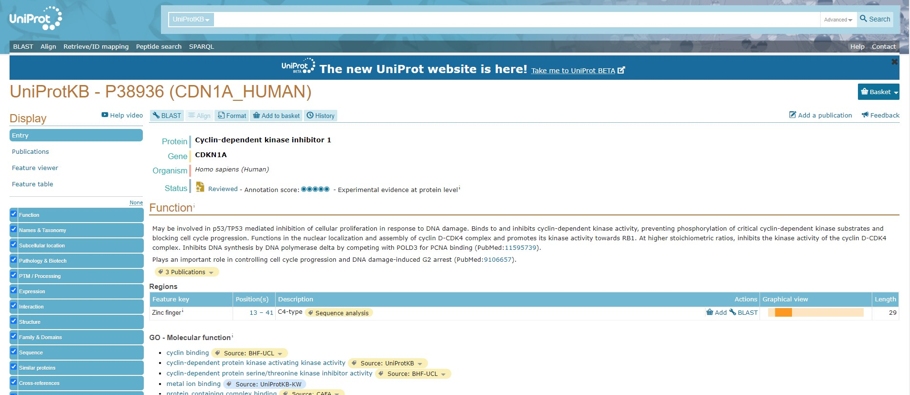
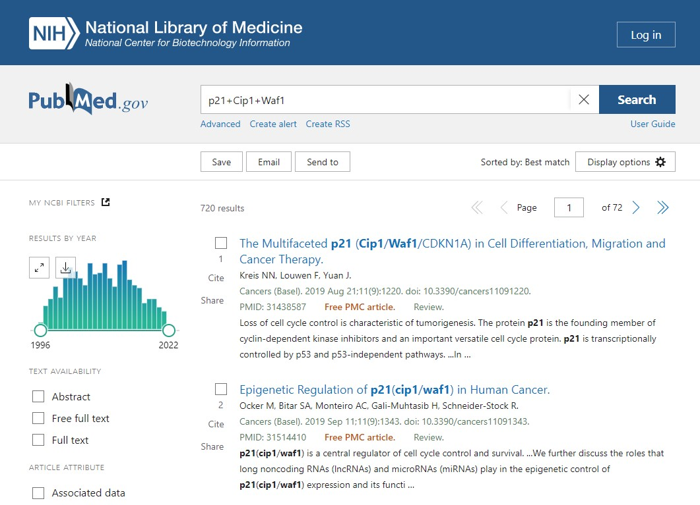
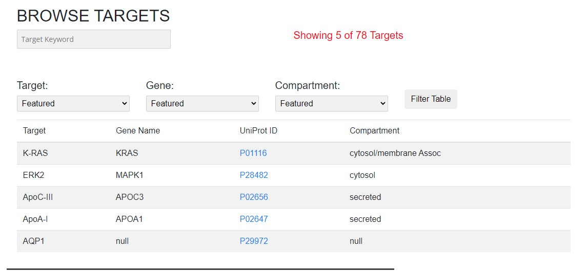
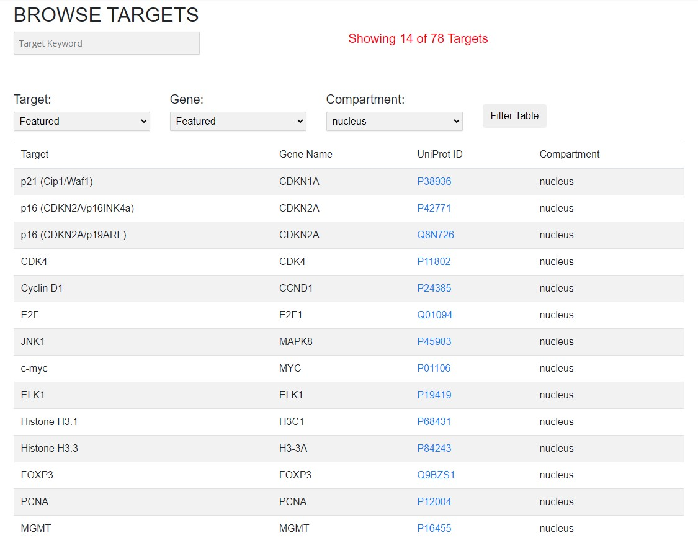
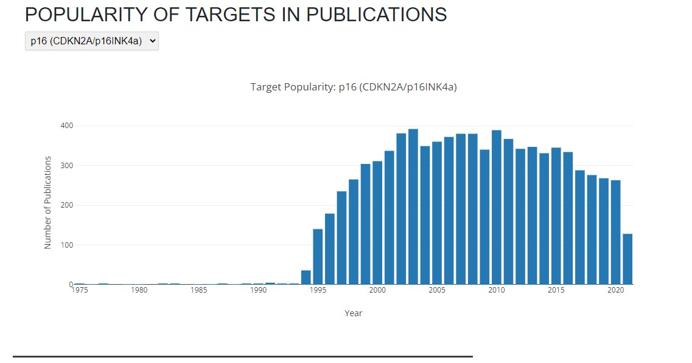
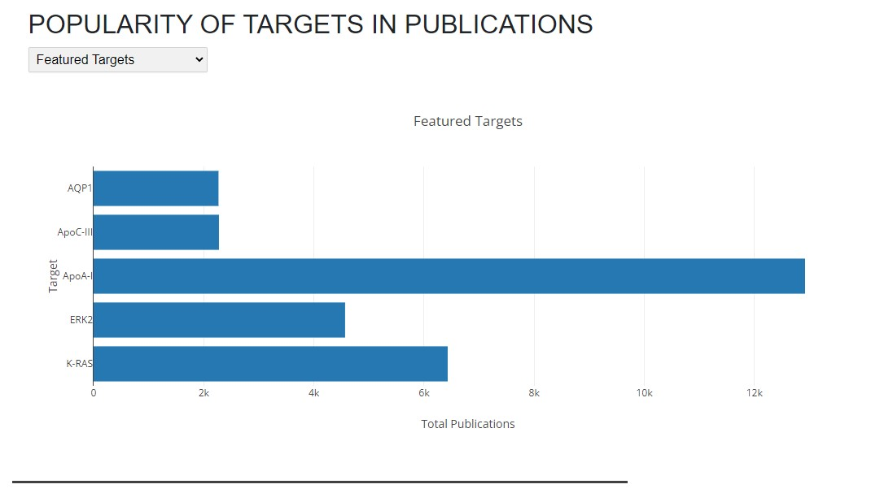

# web-scraping-proteins  

Author: Erin James Wills, ejw-data@gmail.com  

  
<cite>Photo by <a href="https://unsplash.com/@nci?utm_source=unsplash&utm_medium=referral&utm_content=creditCopyText">National Cancer Institute</a> on <a href="https://unsplash.com/s/photos/proteins?utm_source=unsplash&utm_medium=referral&utm_content=creditCopyText">Unsplash</a></cite>

 

## Overview  

Webscrape of Pubmed publication data that is used in a single webpage with multiple plotly charts.  The basic structure of the website is updated with an excel spreadsheet to help those who don't know how to code.  

> The content of this repo generated the following webpage:  http://nrtdp.northwestern.edu/targets/  (as of July 2022)

 

## Technologies  
*  Python
*  Pandas
*  Splinter
*  BeautifulSoup
*  Plotly
*  HTML/CSS/JS

   

## Data Source  

The dataset is generated by scraping the Pubmed search results based on a protein name:  
*  [Pubmed Search "p21"](https://pubmed.ncbi.nlm.nih.gov/?term=p21) 

 

## Setup and Installation  
1. Environment needs the following:  
    *  Python 3.6+  
    *  pandas
    *  webdriver_manager.chrome
    *  splinter
    *  BeautifulSoup
    *  time
    *  json
1. Activate your environment
1. Clone the repo to your local machine
1. Start Jupyter Notebook within the environment from the repo
1. To run and/or troubleshoot the scraping, run `pubmed_scrape.ipynb`.  
1.   To view the index page, I suggest that you use a VSCode Extension called "LiveServer" to view the `index.html` file.  

 

## Images  
 

 

 

 

 

 

 
