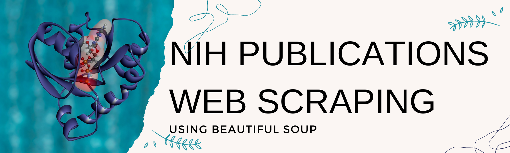

# web-scraping-proteins  

Author: Erin James Wills, ejw-data@gmail.com  

  
<cite>Photo by <a href="https://unsplash.com/@nci?utm_source=unsplash&utm_medium=referral&utm_content=creditCopyText">National Cancer Institute</a> on <a href="https://unsplash.com/s/photos/proteins?utm_source=unsplash&utm_medium=referral&utm_content=creditCopyText">Unsplash</a></cite>

 

## Overview  

Webscrape of Pubmed publication data that is used in a single webpage with multiple plotly charts.  The basic structure of the website is updated with an excel spreadsheet to help those who don't know how to code.  

http://nrtdp.northwestern.edu/targets/  